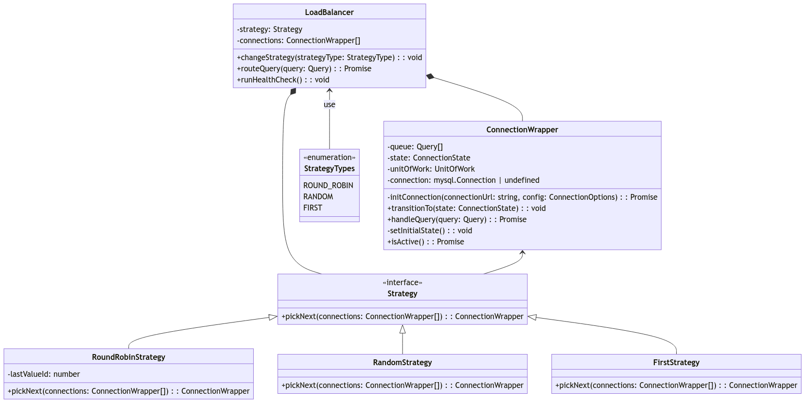
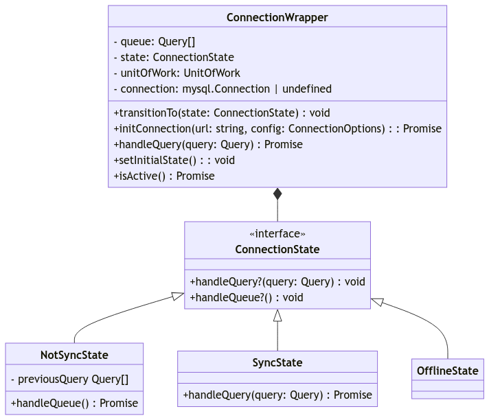
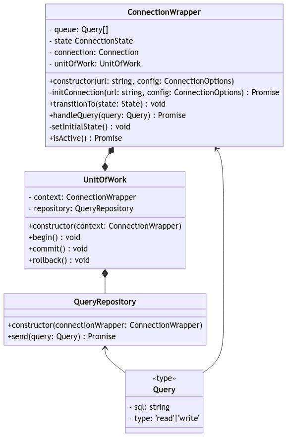
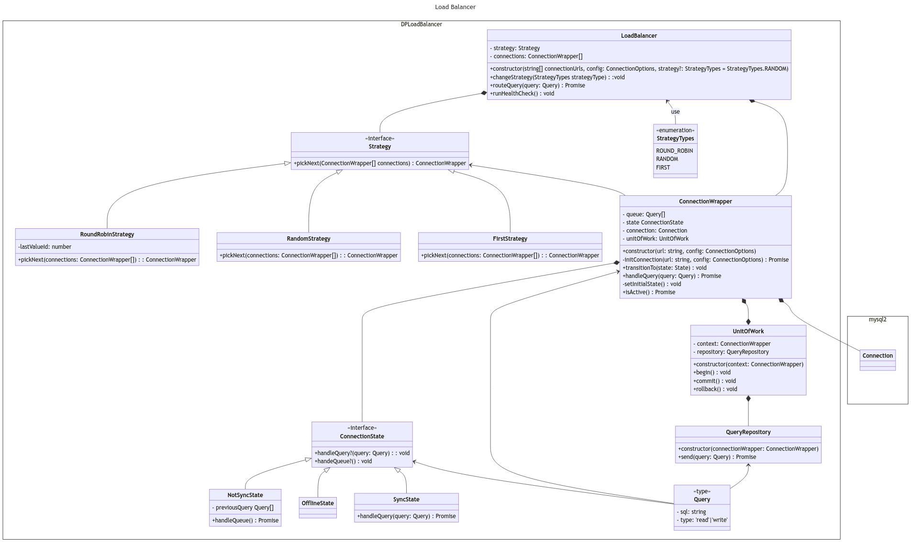
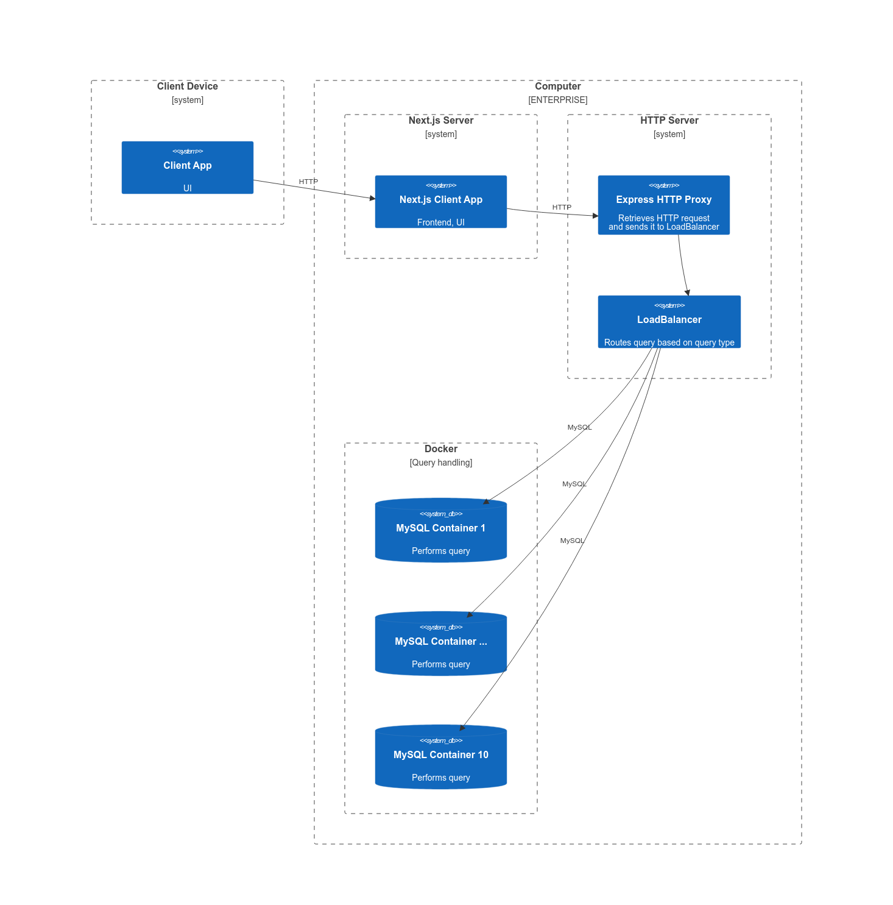
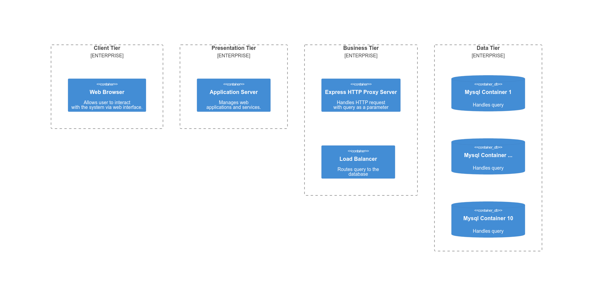

# Load Balancer for Databases

## Team Members

- Patryk Kożuch
- Norbert Klockiewicz
- Kacper Majchrzak
- Karol Błaszczak

## Project Overview

Our project focuses on creating a Load Balancer in JavaScript/TypeScript, designed to distribute traffic among multiple equivalent databases. This application ensures data integrity across these databases, providing a robust solution for handling database queries efficiently.

This project is not a fully working load balancer - it is a proof of concept of how it the Drizzle's proxy can be use to implement load balancing features.

## Purpose of the project
The main purpose was to implement load balancing feature which balances read queries across multiple databases using different strategies, but in the same time keeps the data synchronised between different databases with some fail-safe features.  

## Technologies

We utilized the following technologies to develop our Load Balancer application:

- **NodeJS**: The core application logic of the Load Balancer.
- **Express**: Acts as an HTTP Proxy between Drizzle and the Load Balancer.
- **Drizzle**: An ORM that our Load Balancer connects to via an HTTP Proxy.
- **NextJS**: The client-side application.
- **MySQL**: Our choice of database.
- **Docker**: Manages the database containers.

## Design Patterns

### Strategy Pattern



- **Application**: We use the Strategy pattern to provide different load balancing strategies (RandomStrategy, RoundRobinStrategy, FirstStrategy). The LoadBalancer class holds a reference to the current strategy and delegates the choice of the next connection to it. Switching between strategies allows the system's behavior to be adjusted without modifying the LoadBalancer itself.
- **Justification**: This pattern defines a family of algorithms, encapsulates each one, and makes them interchangeable. It allows the client (LoadBalancer, in this case) to dynamically select an algorithm from a family of algorithms.

### State Pattern



- **Application**: The State pattern is implemented using various connection states (NotSyncState, OfflineState, SyncState). The ConnectionWrapper class holds a reference to the current state and delegates behavior to the state. Implementing connection states allows the ConnectionWrapper's behavior to dynamically change based on the connection's current state.
- **Justification**: This pattern allows an object to change its behavior when its internal state changes. It encapsulates different states and their transitions, facilitating the addition of new states or modification of existing ones without client code changes.

### Unit of Work Pattern



- **Application**: The Unit of Work pattern is used to group database operations into a single transaction. The methods begin, commit, rollback in the UnitOfWork class allow controlling transactions at the unit of work level, enabling safe and consistent execution of database operations.
- **Justification**: This pattern helps ensure that a series of related operations are treated as a single transaction, maintaining the atomicity of database operations. It promotes consistency and integrity of database operations.

## Architecture

### Class Diagram



### Physical Architecture



### Logical Architecture



## Getting Started

To get started with our Load Balancer, please follow the instructions below:

1. **Clone the repository:**

```bash
git clone https://github.com/your-github-repo/load-balancer.git
```
2. **Build and run docker** 
```bash 
    docker compose build
    docker compose -f compose.yaml up
```
